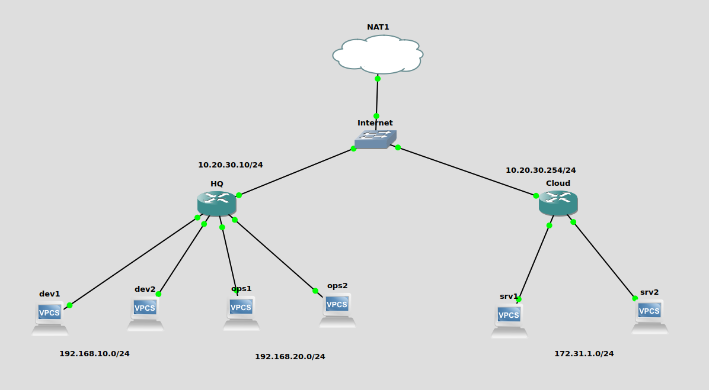

# Mikrotik IPsec Tunnel Setup

Although there are a few new and shiny VPN tunneling protocol like WireGuard, IPsec is still the king of enterprise grade for site-to-site VPN tunnteling. It is not as easy as WireGuard to setup on Mikrotik. Personally I like Mikrotik a lot of its RouterOS based on Linux and pricing model for all hardware. At least, it doesn't break my bank for all the features I want to work with.&#x20;

## Prerequisites&#x20;

* GNS3 Emulator
* Mikrotik CHR appliance setup on GNS3&#x20;
* Mikrotik RouterOS version 7.7
* Basic level of comfortableness with Mikrotik RouterOS CLI and GNS3 setup

## &#x20;Network Topology

<figure><figcaption><p>Mikrotik IPsec Tunneling</p></figcaption></figure>

* Two sites - HQ and Coud. Each site has the IP address of 10.20.30.0/24 subnet as shown in the diagram.
* HQ has two VLANs - 100 for Dev team and 200 for OPS team at its site. Only Dev team can access to the resources in Cloud since it is not that cheap.
* Cloud has only one connected subnet of 172.31.1.0/24 where they host their Dev servers.
* Internet switch is the representation of the internet connection via NAT in GNS3.

## Configuration&#x20;

### HQ router config

Here is the full configuration of HQ router on the left in the diagram and its description.&#x20;

```
# Change the device name
/system identity
set name=hq

# Create two bridge interfaces, "dev" and "ops"
/interface bridge
add name=dev
add name=ops

# Name the interface ether1 to "wan"
/interface ethernet
set [ find default-name=ether1 ] disable-running-check=no name=wan

# Assign vlan 100 and 200 to relevant interface and its name
/interface vlan
add interface=ether2 name=dev1 vlan-id=100
add interface=ether3 name=dev2 vlan-id=100
add interface=ether4 name=ops1 vlan-id=200
add interface=ether5 name=ops2 vlan-id=200

# Assign the physical interfaces to relevant bridge with its VLAN tag
/interface bridge port
add bridge=dev interface=ether2 pvid=100
add bridge=dev interface=ether3 pvid=100
add bridge=ops interface=ether4 pvid=200
add bridge=ops interface=ether5 pvid=200

# Assign WAN interface IP and LAN IPs to both dev and ops bridges.
/ip address
add address=10.20.30.10/24 comment=WAN interface=wan network=10.20.30.0
add address=192.168.10.1/24 interface=dev network=192.168.10.0
add address=192.168.20.1/24 interface=ops network=192.168.20.0

# Create IP pools for both LAN bridges for DHCP server
/ip pool
add name=dev ranges=192.168.10.2-192.168.10.254
add name=ops ranges=192.168.20.2-192.168.20.254

# Ensure to disale DHCP client on the interface ether1 or "wan" 
/ip dhcp-client
add disabled=yes interface=wan

# Define DHCP servers with dev and ops IP pools
/ip dhcp-server
add address-pool=dev interface=dev name=dhcp1
add address-pool=ops interface=ops name=dhcp2

# Define DHCP parameters for both DHCP servers created in previous step
# At this stage, the PCs connected each bridge interface should get IP addresses from DHCP servers
/ip dhcp-server network
add address=192.168.10.0/24 dns-server=1.1.1.1 gateway=192.168.10.1
add address=192.168.20.0/24 dns-server=8.8.8.8 gateway=192.168.20.1

# HQ side IPsec configuration
# Create IPsec profile firstly
/ip ipsec profile
add dh-group=modp2048 enc-algorithm=aes-256 hash-algorithm=sha512 name=ipsec-to-cloud

# Define the peer "cloud" for IPsec
/ip ipsec peer
add address=10.20.30.254/32 exchange-mode=ike2 name=ipsec-cloud profile=ipsec-to-cloud

# Set IPsec proposal 
/ip ipsec proposal
add auth-algorithms=sha512 enc-algorithms=aes-256-cbc name=ike2-proposal pfs-group=modp2048

# Define IPsec policy with its parameters
/ip ipsec policy
add dst-address=172.31.1.0/24 peer=ipsec-cloud proposal=ike2-proposal src-address=192.168.10.0/24 tunnel=yes

# Define the pre shared key for IPsec tunnel authentication
/ip ipsec identity
add peer=ipsec-cloud auth-method=pre-shared-key secret=12345

# Configure the firewall NAT rules for IPsec and masquerade to pass the traffic from LAN to WAN 
/ip firewall nat
add action=accept chain=srcnat comment=ipsec dst-address=172.31.1.0/24 src-address=192.168.10.0/24
add action=masquerade chain=srcnat out-interface=wan

# Set a default route for HQ's LAN to Cloud's LAN traffic through IPsec tunnel
/ip route
add comment=ipsec disabled=no distance=1 dst-address=172.31.1.0/24 gateway=dev
```

### Cloud router config

Here is the full configuration on Cloud router for both LAN and WAN setup.

```
# Change the device name
/system identity
set name=cloud

# Create "srv" bridge interface to serve as LAN
/interface bridge
add name=srv

# Name the interface ether1 as "wan"
/interface ethernet
set [ find default-name=ether1 ] disable-running-check=no name=wan

# Assign the interface ether2 and ether3 to srv bridge
/interface bridge port
add bridge=srv interface=ether2
add bridge=srv interface=ether3

# Assign WAN and LAN IPs
/ip address
add address=10.20.30.254/24 comment=WAN interface=wan network=10.20.30.0
add address=172.31.1.1/24 interface=srv network=172.31.1.0

# Create IP pool for DHCP server on LAN 
/ip pool
add name=dhcp1 ranges=172.31.1.2-172.31.1.254

# Ensure to disable the DHCP client on ether1 or wan interface
/ip dhcp-client
add disabled=yes interface=wan

# Configure DHCP server on LAN side at srv bridge
/ip dhcp-server
add address-pool=dhcp1 interface=srv name=dhcp1

# Set DHCP server network parameters
# At this stage, all servers connected to "srv" bridge should get IP addresses from DHCP server
/ip dhcp-server network
add address=172.31.1.0/24 dns-server=1.1.1.1 domain=cloud.com gateway=172.31.1.1

# Cloud IPsec configuration
/ip ipsec profile
add dh-group=modp2048 enc-algorithm=aes-256 hash-algorithm=sha512 name=ipsec-to-hq
/ip ipsec peer
add address=10.20.30.10/32 exchange-mode=ike2 name=ipsec-hq profile=ipsec-to-hq
/ip ipsec proposal
add auth-algorithms=sha512 enc-algorithms=aes-256-cbc name=ike2-proposal pfs-group=modp2048
/ip ipsec policy
add dst-address=192.168.10.0/24 peer=ipsec-hq proposal=ike2-proposal src-address=172.31.1.0/24 tunnel=yes
/ip ipsec identity
add peer=ipsec-hq auth-method=pre-shared-key secret=12345

# Configure firewall NAT rules for IPsec tunnel and masquerade to pass LAN to WAN traffic
/ip firewall nat
add action=accept chain=srcnat comment=ipsec dst-address=192.168.10.0/24 src-address=172.31.1.0/24
add action=masquerade chain=srcnat out-interface=wan

# Define a static route for Cloud's LAN to HQ's LAN traffic throug IPsec tunnel
/ip route
add comment=ipsec disabled=no distance=1 dst-address=192.168.10.0/24 gateway=srv
```

## Testing

To test the IPsec tunnel connectivity, run the following command on each side of the tunnel.

```
[admin@hq] > ip ipsec active-peers print
Columns: ID, STATE, UPTIME, PH2-TOTAL, REMOTE-ADDRESS
# ID            STATE        UPTIME    PH2-TOTAL  REMOTE-ADDRESS
0 10.20.30.254  established  1h48m41s          1  10.20.30.254 

[admin@cloud] > ip ipsec active-peers print
Flags: R - RESPONDER
Columns: ID, STATE, UPTIME, PH2-TOTAL, REMOTE-ADDRESS
#   ID           STATE        UPTIME    PH2-TOTAL  REMOTE-ADDRESS
0 R 10.20.30.10  established  1h49m23s          1  10.20.30.10 
```

Based on the above output, the IPsec tunnel is up and running. By now, you should be able to ping the servers in cloud from dev1 and dev2 PCs at HQ site.

```
# srv1 in Cloud
srv1> dhcp 
DORA IP 172.31.1.254/24 GW 172.31.1.1

srv1> show ip

NAME        : srv1[1]
IP/MASK     : 172.31.1.254/24
GATEWAY     : 172.31.1.1
DNS         : 1.1.1.1  
DHCP SERVER : 172.31.1.1
DHCP LEASE  : 582, 600/300/525
DOMAIN NAME : cloud.com
MAC         : 00:50:79:66:68:02
LPORT       : 10054
RHOST:PORT  : 127.0.0.1:10055
MTU         : 1500


# srv2 in Cloud
srv2> dhcp
DORA IP 172.31.1.253/24 GW 172.31.1.1

srv2> show ip

NAME        : srv2[1]
IP/MASK     : 172.31.1.253/24
GATEWAY     : 172.31.1.1
DNS         : 1.1.1.1  
DHCP SERVER : 172.31.1.1
DHCP LEASE  : 522, 600/300/525
DOMAIN NAME : cloud.com
MAC         : 00:50:79:66:68:03
LPORT       : 10056
RHOST:PORT  : 127.0.0.1:10057
MTU         : 1500


# dev1 at HQ 
dev1> dhcp 
DORA IP 192.168.10.254/24 GW 192.168.10.1

dev1> show ip

NAME        : dev1[1]
IP/MASK     : 192.168.10.254/24
GATEWAY     : 192.168.10.1
DNS         : 1.1.1.1  
DHCP SERVER : 192.168.10.1
DHCP LEASE  : 588, 600/300/525
MAC         : 00:50:79:66:68:00
LPORT       : 10018
RHOST:PORT  : 127.0.0.1:10019
MTU         : 1500

dev1> ping 172.31.1.254

84 bytes from 172.31.1.254 icmp_seq=1 ttl=62 time=4.620 ms
84 bytes from 172.31.1.254 icmp_seq=2 ttl=62 time=1.299 ms
84 bytes from 172.31.1.254 icmp_seq=3 ttl=62 time=1.245 ms
84 bytes from 172.31.1.254 icmp_seq=4 ttl=62 time=1.179 ms
84 bytes from 172.31.1.254 icmp_seq=5 ttl=62 time=1.358 ms

dev1> ping 172.31.1.253

84 bytes from 172.31.1.253 icmp_seq=1 ttl=62 time=2.229 ms
84 bytes from 172.31.1.253 icmp_seq=2 ttl=62 time=1.154 ms
84 bytes from 172.31.1.253 icmp_seq=3 ttl=62 time=1.285 ms
84 bytes from 172.31.1.253 icmp_seq=4 ttl=62 time=1.495 ms
84 bytes from 172.31.1.253 icmp_seq=5 ttl=62 time=1.370 ms


# dev2 at HQ
dev2> dhcp
DORA IP 192.168.10.253/24 GW 192.168.10.1

dev2> show ip 

NAME        : dev2[1]
IP/MASK     : 192.168.10.253/24
GATEWAY     : 192.168.10.1
DNS         : 1.1.1.1  
DHCP SERVER : 192.168.10.1
DHCP LEASE  : 585, 600/300/525
MAC         : 00:50:79:66:68:01
LPORT       : 10052
RHOST:PORT  : 127.0.0.1:10053
MTU         : 1500

dev2> ping 172.31.1.254

84 bytes from 172.31.1.254 icmp_seq=1 ttl=62 time=1.406 ms
84 bytes from 172.31.1.254 icmp_seq=2 ttl=62 time=1.353 ms
84 bytes from 172.31.1.254 icmp_seq=3 ttl=62 time=1.433 ms
84 bytes from 172.31.1.254 icmp_seq=4 ttl=62 time=1.287 ms
84 bytes from 172.31.1.254 icmp_seq=5 ttl=62 time=1.130 ms

dev2> ping 172.31.1.253

84 bytes from 172.31.1.253 icmp_seq=1 ttl=62 time=1.162 ms
84 bytes from 172.31.1.253 icmp_seq=2 ttl=62 time=1.310 ms
84 bytes from 172.31.1.253 icmp_seq=3 ttl=62 time=1.039 ms
84 bytes from 172.31.1.253 icmp_seq=4 ttl=62 time=1.331 ms
84 bytes from 172.31.1.253 icmp_seq=5 ttl=62 time=1.367 ms


# ops1 at HQ
ops1> dhcp
DORA IP 192.168.20.254/24 GW 192.168.20.1

ops1> show ip

NAME        : ops1[1]
IP/MASK     : 192.168.20.254/24
GATEWAY     : 192.168.20.1
DNS         : 8.8.8.8  
DHCP SERVER : 192.168.20.1
DHCP LEASE  : 590, 600/300/525
MAC         : 00:50:79:66:68:04
LPORT       : 10058
RHOST:PORT  : 127.0.0.1:10059
MTU         : 1500

ops1> ping 172.31.1.254

172.31.1.254 icmp_seq=1 timeout
172.31.1.254 icmp_seq=2 timeout
172.31.1.254 icmp_seq=3 timeout
172.31.1.254 icmp_seq=4 timeout
172.31.1.254 icmp_seq=5 timeout

ops1> ping 172.31.1.253

172.31.1.253 icmp_seq=1 timeout
172.31.1.253 icmp_seq=2 timeout
172.31.1.253 icmp_seq=3 timeout
172.31.1.253 icmp_seq=4 timeout
172.31.1.253 icmp_seq=5 timeout


# ops2 at HQ
ops2> dhcp
DORA IP 192.168.20.253/24 GW 192.168.20.1

ops2> show ip

NAME        : ops2[1]
IP/MASK     : 192.168.20.253/24
GATEWAY     : 192.168.20.1
DNS         : 8.8.8.8  
DHCP SERVER : 192.168.20.1
DHCP LEASE  : 580, 600/300/525
MAC         : 00:50:79:66:68:05
LPORT       : 10060
RHOST:PORT  : 127.0.0.1:10061
MTU         : 1500

ops2> ping 172.31.1.254

172.31.1.254 icmp_seq=1 timeout
172.31.1.254 icmp_seq=2 timeout
172.31.1.254 icmp_seq=3 timeout
172.31.1.254 icmp_seq=4 timeout
172.31.1.254 icmp_seq=5 timeout

ops2> ping 172.31.1.253

172.31.1.253 icmp_seq=1 timeout
172.31.1.253 icmp_seq=2 timeout
172.31.1.253 icmp_seq=3 timeout
172.31.1.253 icmp_seq=4 timeout
172.31.1.253 icmp_seq=5 timeout
```

The ping test should be also successful from srv1 and srv2 in Cloud to dev1 and dev2 at HQ as well.&#x20;
