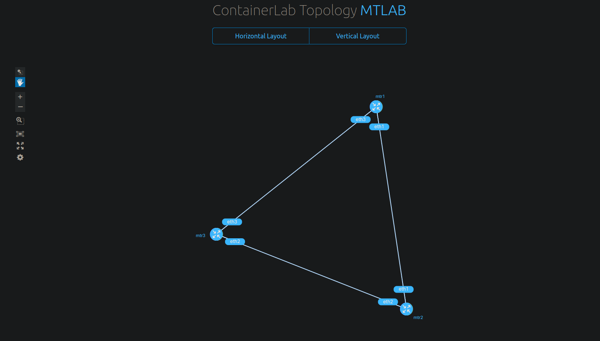

# MikroTik network setup with Containerlab

I have recently heard about Containerlab on multiple podcasts, and everyone on those podcasts talked good stuff about it. So I decided to check it out in my own time to see what the hype is all about.

First of all, I have been using GNS3 for my networking labs on my local computer or GNS3 VM setup. GNS3 has been an amazing opensource project for all walks of life since it has a growing community of supporting different vendors plus docker container. When I started my IT journey, it was quite expensive to have an own networking lab even for CCNA level studying. I vividly remember that every network engineer used to have a full stacks of rack with Cisco routers and switches for their home lab. It was a very expensive investment to enter the realm of networking industry. There was a virtual network simulator from Cisco called Packet Tracer but it was nothing like working on the actual networking gears. So it was quite confusing and that's how the training institutes used to train networking students.

After I found there was a better solution than Packet Tracer and full stacks of noisy expensive networking gears in rack, I saw the opportunity of actual learning networking with virtual environment. It was and still is GNS3. Initially it was too good to be true but the more I used the software, the more I understand how important the opensource is for all IT tech's home lab. It opened my eyes to look around more and be aware of the existence of all opensource solutions for home and business. The limit is the sky. If I have a willingness to learn something these days, I can learn it free on YouTube or reading some blog posts and articles. For home lab setup, most of the things can be done with a bare minimum hardware and some opensource/free software. That's how I have been doing my home lab and learning new stuffs in IT.

Technologies have been changing exponentially nowadays. It is a bit difficult to chew everything and even digest them all to get my head around it. However this is how we roll in IT if we want to keep abreast with new tech. Learning never stops and life goes on.

Now let's explore a little bit about Containerlab. Assuming that you are using one of the popular Linux distributions like Ubuntu. Here is how to install Containerlab through apt package manager.

```bash
echo "deb [trusted=yes] https://apt.fury.io/netdevops/ /" | \
sudo tee -a /etc/apt/sources.list.d/netdevops.list

sudo apt update && sudo apt install containerlab
```

Or run the following commands if you are using RPM based package manager like yum.

```bash
yum-config-manager --add-repo=https://yum.fury.io/netdevops/ && \
echo "gpgcheck=0" | sudo tee -a /etc/yum.repos.d/yum.fury.io_netdevops_.repo

sudo yum install containerlab
```

After the installation, verify that it has been probably installed on your computer by running the following command.

```bash
clab version 

                           _                   _       _     
                 _        (_)                 | |     | |    
 ____ ___  ____ | |_  ____ _ ____   ____  ____| | ____| | _  
/ ___) _ \|  _ \|  _)/ _  | |  _ \ / _  )/ ___) |/ _  | || \ 
( (__| |_|| | | | |_( ( | | | | | ( (/ /| |   | ( ( | | |_) )
\____)___/|_| |_|\___)_||_|_|_| |_|\____)_|   |_|\_||_|____/ 

    version: 0.47.2
     commit: 0b3991f0
       date: 2023-10-26T10:18:52Z
     source: https://github.com/srl-labs/containerlab
 rel. notes: https://containerlab.dev/rn/0.47/#0472
```

If you want to upgrade your current version to the latest one available at its repository, run the following command.

```bash
sudo containerlab version upgrade
```

Now it is ready to start using the Containerlab for the MikroTik lab. It is quite easy to bring up a whole lab within a few minutes without adding required images or templates like GNS3. All you need to initiate the lab is a YAML file looks like this.

```yaml
name: mtlab
topology:
  nodes:
    mtr1:
      kind: vr-ros
      image: docker.io/iparchitechs/chr:stable
    mtr2:
      kind: vr-ros
      image: docker.io/iparchitechs/chr:stable
    mtr3:
      kind: vr-ros
      image: docker.io/iparchitechs/chr:stable

  links:
    - endpoints: ["mtr1:eth1", "mtr2:eth1"]
    - endpoints: ["mtr2:eth2", "mtr3:eth2"]
    - endpoints: ["mtr3:eth3", "mtr1:eth3"]
```

This YAML configuration is for defining a topology for Containerlab, a tool used for creating and managing container-based network labs. In this specific configuration, a network topology named "mtlab" is defined with three virtual routers running a RouterOS (ROS) container image. Let's break down the YAML file:

1. `name: mtlab`: This specifies the name of the network topology, which is "mtlab."
2.  `topology:`: This section defines the network topology and contains two sub-sections: `nodes` and `links`.

    a. `nodes:`: This subsection defines the network nodes, which are containers running virtual routers. In this case, there are three nodes:

    * `mtr*`: This is the first virtual router, identified by the name "mtr\*." It is of kind "vr-ros," which suggests it's a virtual router running RouterOS. It uses the "docker.io/iparchitechs/chr:stable" container image.

    b. `links:`: This subsection defines the connections between the nodes. There are three link connections specified:

    * `endpoints: ["mtr1:eth1", "mtr2:eth1"]`: This defines a link connecting the "eth1" interface of "mtr1" to the "eth1" interface of "mtr2."
    * `endpoints: ["mtr2:eth2", "mtr3:eth2"]`: This defines a link connecting the "eth2" interface of "mtr2" to the "eth2" interface of "mtr3."
    * `endpoints: ["mtr3:eth3", "mtr1:eth3"]`: This defines a link connecting the "eth3" interface of "mtr3" to the "eth3" interface of "mtr1."

In summary, this YAML configuration describes a network topology with three virtual routers running RouterOS (ROS) containers. These routers are connected through defined links, creating a network setup for further testing and experimentation.

After that, it is ready to deploy the network topology with the following command to stand up the lab. If you haven't deployed the YAML with Containerlab previously, it will take a few more seconds to download the Docker images from Docker Hub.

```bash
sudo clab deploy -t mtlab.yml

INFO[0000] Containerlab v0.47.2 started                 
INFO[0000] Parsing & checking topology file: mtlab.yml  
INFO[0000] Creating docker network: Name="clab", IPv4Subnet="172.20.20.0/24", IPv6Subnet="2001:172:20:20::/64", MTU='ל' 
INFO[0000] Creating lab directory: /data/code/containerlab/test/clab-mtlab 
INFO[0000] Creating container: "mtr2"                   
INFO[0000] Creating container: "mtr1"                   
INFO[0000] Creating container: "mtr3"                   
INFO[0001] Creating link: mtr2:eth2 <--> mtr3:eth2      
INFO[0001] Creating link: mtr1:eth1 <--> mtr2:eth1      
INFO[0001] Creating link: mtr3:eth3 <--> mtr1:eth3      
INFO[0001] Adding containerlab host entries to /etc/hosts file 
INFO[0001] Adding ssh config for containerlab nodes     
+---+-----------------+--------------+-----------------------------------+--------+---------+----------------+----------------------+
| # |      Name       | Container ID |               Image               |  Kind  |  State  |  IPv4 Address  |     IPv6 Address     |
+---+-----------------+--------------+-----------------------------------+--------+---------+----------------+----------------------+
| 1 | clab-mtlab-mtr1 | 6d55a849f9ca | docker.io/iparchitechs/chr:stable | vr-ros | running | 172.20.20.3/24 | 2001:172:20:20::3/64 |
| 2 | clab-mtlab-mtr2 | 58e47bd51dcb | docker.io/iparchitechs/chr:stable | vr-ros | running | 172.20.20.2/24 | 2001:172:20:20::2/64 |
| 3 | clab-mtlab-mtr3 | 47468cb9a224 | docker.io/iparchitechs/chr:stable | vr-ros | running | 172.20.20.4/24 | 2001:172:20:20::4/64 |
+---+-----------------+--------------+-----------------------------------+--------+---------+----------------+----------------------+
```

As you can see, it has been setup according to what we have defined in the YAML file. To ssh into each virtual router, both DNS name and IP can be used for remote access. The default login username is 'admin' and the password 'admin'.

```bash
ssh admin@clab-mtlab-mtr1
Warning: Permanently added 'clab-mtlab-mtr1' (RSA) to the list of known hosts.
admin@clab-mtlab-mtr1's password: 


  MMM      MMM       KKK                          TTTTTTTTTTT      KKK
  MMMM    MMMM       KKK                          TTTTTTTTTTT      KKK
  MMM MMMM MMM  III  KKK  KKK  RRRRRR     OOOOOO      TTT     III  KKK  KKK
  MMM  MM  MMM  III  KKKKK     RRR  RRR  OOO  OOO     TTT     III  KKKKK
  MMM      MMM  III  KKK KKK   RRRRRR    OOO  OOO     TTT     III  KKK KKK
  MMM      MMM  III  KKK  KKK  RRR  RRR   OOOOOO      TTT     III  KKK  KKK

  MikroTik RouterOS 7.2 (c) 1999-2022       https://www.mikrotik.com/

Press F1 for help
 
[admin@mtr1] > export
# nov/05/2023 05:44:08 by RouterOS 7.2
# software id = 
#
/disk
set sata1 disabled=no
/interface wireless security-profiles
set [ find default=yes ] supplicant-identity=MikroTik
/port
set 0 name=serial0
/ip address
add address=172.31.255.30/30 interface=ether1 network=172.31.255.28
/ip dhcp-client
add interface=ether1
/system identity
set name=mtr1
[admin@mtr1] > quit
Connection to clab-mtlab-mtr1 closed.
```

If you want to visualise the topology, it can also done with this command.

```bash
sudo clab graph -t mtlab.yml
INFO[0000] Parsing & checking topology file: mtlab.yml  
INFO[0000] Serving static files from directory: /etc/containerlab/templates/graph/nextui/static 
INFO[0000] Serving topology graph on http://0.0.0.0:50080
```

<figure><figcaption></figcaption></figure>

To exit out of the Containerlab graph, press ctrl + c. Within a few seconds, you have a whole MikroTik lab setup with Containerlab; the major benefits with this approach are re-usability and version controllable with Git. All the information about what kind of devices, what version of RouterOS and links between all routers are captured in one YAML file. I am quite fancy of this kind of network lab setup. It will save lots of my time and energy not to find the right images for templates available in GNS3. I can see myself using Containerlab a lot not only for the networking lab but also for any other kinds of devices available on it.

If you want to wipe it clean after using the lab (ensure that you have the devices' configuration backup though), you can use the following command to clean it up. Of course, you can also definitely provide your own startup configuration on each device with `startup-config` key if you like.

```bash
sudo clab destroy -t mtlab.yml
INFO[0000] Parsing & checking topology file: mtlab.yml  
INFO[0000] Destroying lab: mtlab                        
INFO[0000] Removed container: clab-mtlab-mtr2           
INFO[0000] Removed container: clab-mtlab-mtr3           
INFO[0000] Removed container: clab-mtlab-mtr1           
INFO[0000] Removing containerlab host entries from /etc/hosts file 
INFO[0000] Removing ssh config for containerlab nodes 
```
