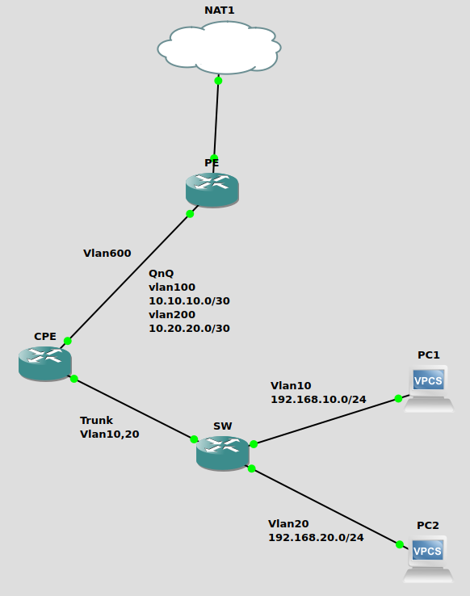

# Mikrotik QinQ VLAN trunking and policy routing

In my GNS3 home lab, I have extended the VLAN trunking lab to the more interesting VLAN concept of VLAN Q-in-Q or 802.1ad Ethernet standard for Mikrotik devices. It can sound very complicated with the configuration on Cisco's IOS XE networking devices but it is not the case with the mighty Mikrotik's RouterOS.&#x20;

In this lab, I have to rearrange the connectivity and device config a bit to align with the scenario I want to test. This kind of setup can be very common in the Metro Ethernet networks for tagging the multiple VLANs inside the primary VLAN provisioned by your provider for the uplink to WAN or the internet. Imagine that the ISP has provisioned a VLAN to extend the layer2 network from the provider edge (PE) device to the customer-premises equipment (CPE) in MPLS network. Inside that VLAN, the provider also want to tag additional VLANs to separate the data traffic from the voice traffic in order to cap the bandwidth or perform QoS on the link. The provider can utilise the IEEE 802.1ad or QinQ VLAN trunking (basically IEEE 802.1q inside the IEEE 802.1q) on Mikrotik devices. Sometimes people refer it as 802.1q tunneling in Cisco networking.&#x20;

Additionally, the policy routing has to be implemented on CPE to handle the downstream LANs for routing.&#x20;

## Prerequisites&#x20;

* GNS3 Emulator
* Mikrotik CHR appliance setup on GNS3&#x20;
* Mikrotik RouterOS version 7.7
* Basic level of comfortableness with Mikrotik RouterOS CLI and GNS3 setup

## &#x20;Network Topology

<figure><figcaption><p>Mikrotik QinQ VLAN trunking</p></figcaption></figure>

* Provider edge (PE) router - PE is a provider's router provisioned in its core network to provide MPLS WAN connectivity or the internet service to end customers
* Customer-premises equipment (CPE) router - CPE is a router or L3 switch installed at customer site to terminate the connectivity for MPLS or the internet service.&#x20;
* Switch (SW) - SW is a Layer2 switch to distribute the connectivity among different tenants at the same apartment or office compound.&#x20;
* Customer1 - PC1 is a customer who only subscribe for data service.
* Customer2 - PC2 is a customer who only subscribe for voice service.&#x20;

### Configuration

#### PE router config

Here is the full configuraiton for PE router in the topoloy.

```
# Interface ether2 with cust1's VLAN 600 is the backbone uplink for connectivity.
# Inside the cust1 VLAN 600, data VLAN 100 and voice VLAN 200 are provisioned. 
/interface vlan
add interface=ether2 name=cust1 vlan-id=600
add interface=cust1 name=cust1_data vlan-id=100
add interface=cust1 name=cust1_voice vlan-id=200

# Assign relevant ip address and its subnet for each VLAN
/ip address
add address=10.10.10.1/30 interface=cust1_data network=10.10.10.0
add address=10.20.20.1/30 interface=cust1_voice network=10.20.20.0

# Configure dhcp-client on ether1 for internet breakout
/ip dhcp-client
add interface=ether1

# Setup masquerade NAT firewall rule for internet breakout from this topology
/ip firewall nat
add action=masquerade chain=srcnat out-interface=ether1

# Set the system name to pe
/system identity
set name=pe
```

Note that the cust1\_data and cust1\_voice VLANs are nested to the backbone uplink VLAN 600 as configured on PE. &#x20;

#### CPE router config

Here is the full configuration for CPE router.

```
# Create two VLANs 10 and 20 for downstream to separate lan1 from lan2
# Tag VLAN 600 at receiving end as wan for backbone uplink 
# Then VLAN 100 and 200 are stacked inside VLAN 600 to separate data from voice traffic 
/interface vlan
add interface=ether2 name=lan1 vlan-id=10
add interface=ether2 name=lan2 vlan-id=20
add interface=ether1 name=wan vlan-id=600
add interface=wan name=data vlan-id=100
add interface=wan name=voice vlan-id=200

# Create ip pool for DHCP scope for lan1 and lan2
/ip pool
add name=lan1 ranges=192.168.10.2-192.168.10.254
add name=lan2 ranges=192.168.20.2-192.168.20.254

# Setup DHCP server for lan1 and lan2
/ip dhcp-server
add address-pool=lan1 interface=lan1 name=dhcp1
add address-pool=lan2 interface=lan2 name=dhcp2

# Assign ip addresses for downstream and upstream links' VLANs
/ip address
add address=192.168.10.1/24 interface=lan1 network=192.168.10.0
add address=192.168.20.1/24 interface=lan2 network=192.168.20.0
add address=10.10.10.2/30 interface=data network=10.10.10.0
add address=10.20.20.2/30 interface=voice network=10.20.20.0

# Disable default dhcp-client on ether1
/ip dhcp-client
add disabled=yes interface=ether1

# Configure DHCP network parameters for DHCP servers
/ip dhcp-server network
add address=192.168.10.0/24 dns-server=1.1.1.1 gateway=192.168.10.1
add address=192.168.20.0/24 dns-server=8.8.8.8 gateway=192.168.20.1

# Implement a firewall filter rule to segregate two LANs at downstream
/ip firewall filter
add action=drop chain=forward dst-address=192.168.20.0/24 src-address=192.168.10.0/24

# Configure masquerade NAT rules for internet breakout at lan1 and lan2 
/ip firewall nat
add action=masquerade chain=srcnat out-interface=data src-address=192.168.10.0/24
add action=masquerade chain=srcnat out-interface=voice src-address=192.168.20.0/24

# Create 2 policy routing tables
/routing table
add name=data_table fib
add name=voice_table fib

# Create a policy routing rule for each routing table based on src-address
/routing rule
add action=lookup-only-in-table src-address=192.168.10.0/24 table=data_table
add action=lookup-only-in-table src-address=192.168.20.0/24 table=voice_table

# Configure default static routes for data and voice networks with policy routing
/ip route
add dst-address=0.0.0.0/0 gateway=10.10.10.1@main routing-table=data_table
add dst-address=0.0.0.0/0 gateway=10.20.20.1@main routing-table=voice_table

# Set the system name to cpe
/system identity
set name=cpe
```

As shown above, it is not that difficult to understand what is going on with QinQ VLAN trunking between upstream and downstream to manage two types of traffics on CPE. And policy routing is required for handling two downstream LANs routing.&#x20;

#### SW switch config

Here is the full configuration for SW switch device shown in the topology.

```
# Create a bridge with vlan filtering enabled
/interface bridge
add name=sw-br vlan-filtering=yes

# Assign ether1 (trunk port) to the bridge
# Then assign ether2 with vlan 10 and ether3 with vlan 20 taggings to the same bridge 
/interface bridge port
add bridge=sw-br interface=ether1
add bridge=sw-br interface=ether2 pvid=10
add bridge=sw-br interface=ether3 pvid=20

# Configure VLANs tagging and untagging for VLAN 10 and VLAN 20 on the bridge 
/interface bridge vlan
add bridge=sw-br tagged=ether1 untagged=ether2 vlan-ids=10
add bridge=sw-br tagged=ether1 untagged=ether3 vlan-ids=20

# Disable default dhcp-client on ether1
/ip dhcp-client
add disabled=yes interface=ether1

# Set the system name to sw
/system identity
set name=sw
```

### Testing

#### Customer 1 (PC1) - data subscriber test

```
PC1> dhcp
DORA IP 192.168.10.254/24 GW 192.168.10.1

PC1> show ip

NAME        : PC1[1]
IP/MASK     : 192.168.10.254/24
GATEWAY     : 192.168.10.1
DNS         : 1.1.1.1  
DHCP SERVER : 192.168.10.1
DHCP LEASE  : 596, 600/300/525
MAC         : 00:50:79:66:68:00
LPORT       : 10058
RHOST:PORT  : 127.0.0.1:10059
MTU         : 1500

PC1> ping google.com
google.com resolved to 142.250.70.142

84 bytes from 142.250.70.142 icmp_seq=1 ttl=57 time=5.175 ms
84 bytes from 142.250.70.142 icmp_seq=2 ttl=57 time=4.816 ms
84 bytes from 142.250.70.142 icmp_seq=3 ttl=57 time=5.297 ms
84 bytes from 142.250.70.142 icmp_seq=4 ttl=57 time=4.991 ms
84 bytes from 142.250.70.142 icmp_seq=5 ttl=57 time=5.341 ms

PC1> ping 192.168.20.254

192.168.20.254 icmp_seq=1 timeout
192.168.20.254 icmp_seq=2 timeout
192.168.20.254 icmp_seq=3 timeout
192.168.20.254 icmp_seq=4 timeout
192.168.20.254 icmp_seq=5 timeout
```

#### Customer 2 (PC2) - voice subscriber test

```
PC2> dhcp
DORA IP 192.168.20.254/24 GW 192.168.20.1

PC2> show ip

NAME        : PC2[1]
IP/MASK     : 192.168.20.254/24
GATEWAY     : 192.168.20.1
DNS         : 8.8.8.8  
DHCP SERVER : 192.168.20.1
DHCP LEASE  : 597, 600/300/525
MAC         : 00:50:79:66:68:01
LPORT       : 10060
RHOST:PORT  : 127.0.0.1:10061
MTU         : 1500

PC2> ping google.com
google.com resolved to 142.250.70.142

84 bytes from 142.250.70.142 icmp_seq=1 ttl=57 time=4.362 ms
84 bytes from 142.250.70.142 icmp_seq=2 ttl=57 time=5.253 ms
84 bytes from 142.250.70.142 icmp_seq=3 ttl=57 time=6.872 ms
84 bytes from 142.250.70.142 icmp_seq=4 ttl=57 time=5.332 ms
84 bytes from 142.250.70.142 icmp_seq=5 ttl=57 time=4.506 ms

PC2> ping 192.168.10.254

192.168.10.254 icmp_seq=1 timeout
192.168.10.254 icmp_seq=2 timeout
192.168.10.254 icmp_seq=3 timeout
192.168.10.254 icmp_seq=4 timeout
192.168.10.254 icmp_seq=5 timeout
```
