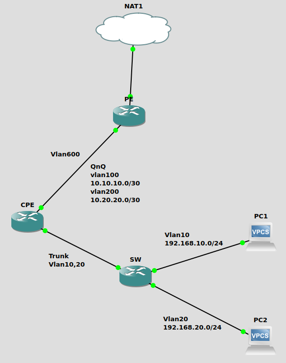

# Mikrotik QinQ VLAN trunking

In my GNS3 home lab, I have extended the VLAN trunking lab to the more interesting VLAN concept of VLAN Q-in-Q or 802.1ad Ethernet standard for Mikrotik devices. It can sound very complicated with the configuration on Cisco's IOS XE networking devices but it is not the case with the mighty Mikrotik's RouterOS.&#x20;

In this lab, I have to rearrange the connectivity and device config a bit to align with the scenario I want to test. This kind of setup can be very common in the Metro Ethernet networks for tagging the multiple VLANs inside the primary VLAN provisioned by your provider for the uplink to WAN or the internet. Imagine that the ISP has provisioned a VLAN to extend the layer2 network from the provider edge (PE) device to the customer-premises equipment (CPE) in MPLS network. Inside that VLAN, the provider also want to tag additional VLANs to separate the data traffic from the voice traffic in order to cap the bandwidth or perform QoS on the link. The provider can utilise the IEEE 802.1ad or QinQ VLAN trunking (basically IEEE 802.1q inside the IEEE 802.1q) on Mikrotik devices. Sometimes people refer it as 802.1q tunneling in Cisco networking.&#x20;

## Prerequisites&#x20;

* GNS3 Emulator
* Mikrotik CHR appliance setup on GNS3&#x20;
* Mikrotik RouterOS version 7.7
* Basic level of comfortableness with Mikrotik RouterOS CLI and GNS3 setup

## &#x20;Network Topology

<figure><figcaption>
Mikrotik QinQ VLAN trunking
</figcaption></figure>
