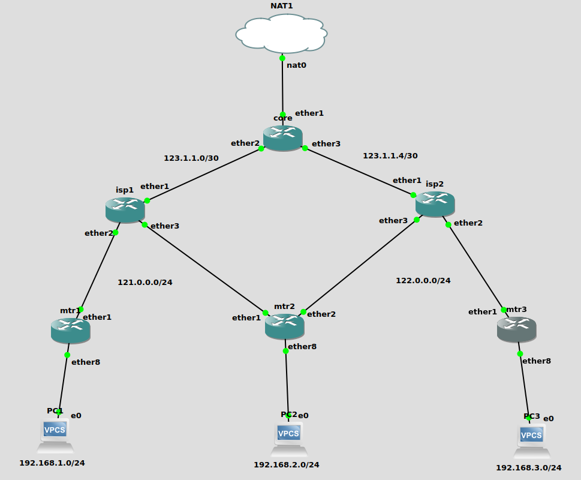

# Mikrotik Use Cases - PPPoE, ECMP, Recursive Routing and WireGuard

Mikrotik RouterOS is a very versatile platform for all sorts of possible network scenario setup in both carrier and enterprise environment. As long as the appropriate Mikrotik harward devices are used in the design, the capability of its platform is unlimited unlike other networking giants. Especially it is even getting better with the latest and greatest version of its RouterOS 7.\*. Although the syntax can be a bit painful to adapt for those Mikrotik CLI veterans, it is still worth it to get the latest features like WireGuard, ZeroTier, etc., on the receiving end. For instance, the most of Mikrotik devices lately come with ARM 32 bit CPU architecture to have more advanced features like containerisation in the box. It is quite ambitious to implement all the bleeding edge features in the RouterOS but I quite appreciate their adventurous spirit of "don't care and can do" attitude towards the very old fashioned industry of networking.&#x20;

In this article, I have been setting up a GNS3 lab to experiment its RouterOS 7.7 features as well as an attempt to keep my rusty networking skills to be refreshed. There are a few use cases I have been wanting to test on this lab as listed below.

* PPPoE server and client configuration
* ECMP configuration for multi-WAN connections
* Recursive routing in simple setup
* WireGuard setup for site-to-site VPN

## Prerequisites&#x20;

* GNS3 Emulator
* Mikrotik CHR appliance setup on GNS3&#x20;
* Mikrotik RouterOS version 7.7
* Basic level of comfortableness with Mikrotik RouterOS CLI and GNS3 setup
* Basic understanding of VPN tunneling and WireGuard in general

## &#x20;Network Topology

<figure><figcaption><p>Mikrotik Use Cases - PPPoE, ECMP, Recursive Routing and WireGuard</p></figcaption></figure>

* One core router "core" to simulate the internet backbone/core connected to NAT1 for the internet breakout connection.
* Two ISP routers "isp1" and "isp2" to simulate the ISP's PPPoE servers on the providers' end.
* Three customer routers "mtr1", "mtr2" and "mtr3" to simulate the enterprise customers' end. "mtr2" is especially used for ECMP and Recursive Routing since it is connected to both "isp1" and "isp2" routers.&#x20;

### Configuration

#### Core router config

Here is the full configuration and its description of "core" router

```
# Assign the static IP addresses for both downstream isp1 and isp2 routers
/ip address
add address=123.1.1.1/30 interface=ether2 network=123.1.1.0
add address=123.1.1.5/30 interface=ether3 network=123.1.1.4

# Configure ether1 as dhcp-client interface (default)
/ip dhcp-client
add interface=ether1

# Configure masquerade NAT firewall rule for the internet breakout
/ip firewall nat
add action=masquerade chain=srcnat out-interface=ether1

# Configure the static routes to both isp1's and isp2's downstream links towards end customers
/ip route
add dst-address=121.0.0.0/24 gateway=123.1.1.2
add dst-address=122.0.0.0/24 gateway=123.1.1.6

# Set the system name to core
/system identity
set name=core
```

ISP routers config&#x20;

Both isp1 and isp2 routers config and its description can be found in the below code snippets.

Here is how I configure the isp1 router.&#x20;

```
# Create a new bridge "pppoe-bridge" to serve multiple customers
/interface bridge
add name=pppoe-bridge

# Create an IP pool for PPPoE server
/ip pool
add name=pppoe-pool ranges=121.0.0.2-121.0.0.254

# Set ppp profile for PPPoE server for its required parameters
/ppp profile
add local-address=121.0.0.1 name=pppoe-server remote-address=pppoe-pool

# Add the ports ether2 and ether3 to newly created pppoe-bridge
/interface bridge port
add bridge=pppoe-bridge interface=ether2
add bridge=pppoe-bridge interface=ether3

# Configure pppoe-server interface with its profile and bridge interface 
/interface pppoe-server server
add default-profile=pppoe-server disabled=no interface=pppoe-bridge service-name=pppoe-service

# Configure the static IP address to ether1 for upstream connection
/ip address
add address=123.1.1.2/30 interface=ether1 network=123.1.1.0

# Disable the default dhcp-client config on ether1
/ip dhcp-client
add disabled=yes interface=ether1

# Configure masquerade NAT firewall rule for the internet breakout
/ip firewall nat
add action=masquerade chain=srcnat out-interface=ether1

# Configure the static route to upstream core router
/ip route
add dst-address=0.0.0.0/0 gateway=123.1.1.1

# Create two PPPoE user accounts associating to its relevant PPPoE server profile
/ppp secret
add name=isp1user1 password=isp1user1 profile=pppoe-server service=pppoe
add name=isp1user2 password=isp1user2 profile=pppoe-server service=pppoe

# Set system name to isp1
/system identity
set name=isp1
```

Here is how I configure the isp2 router.&#x20;

```
# Create a new bridge "pppoe-bridge" to serve multiple customers
/interface bridge
add name=pppoe-bridge

# Create an IP pool for PPPoE server
/ip pool
add name=pppoe-pool ranges=122.0.0.2-122.0.0.254

# Set ppp profile for PPPoE server for its required parameters
/ppp profile
add local-address=122.0.0.1 name=pppoe-server remote-address=pppoe-pool

# Add the ports ether2 and ether3 to newly created pppoe-bridge
/interface bridge port
add bridge=pppoe-bridge interface=ether2
add bridge=pppoe-bridge interface=ether3

# Configure pppoe-server interface with its profile and bridge interface 
/interface pppoe-server server
add default-profile=pppoe-server disabled=no interface=pppoe-bridge service-name=pppoe-service

# Configure the static IP address to ether1 for upstream connection
/ip address
add address=123.1.1.6/30 interface=ether1 network=123.1.1.4

# Disable the default dhcp-client config on ether1
/ip dhcp-client
add disabled=yes interface=ether1

# Configure masquerade NAT firewall rule for the internet breakout
/ip firewall nat
add action=masquerade chain=srcnat out-interface=ether1

# Configure the static route to upstream core router
/ip route
add dst-address=0.0.0.0/0 gateway=123.1.1.5

# Create two PPPoE user accounts associating to its relevant PPPoE server profile
/ppp secret
add name=isp2user1 password=isp2user1 profile=pppoe-server service=pppoe
add name=isp2user2 password=isp2user2 profile=pppoe-server service=pppoe

# Set system name to isp1
/system identity
set name=isp2
```

#### Customer routers config&#x20;

Note that both mtr1 and mtr3 configs are very similar but mtr2 is configured quite differently since it is connected to both isp1 and isp2 routers for upstream internet connection.&#x20;

Here is the full mtr1 router configuration wtih PPPoE Client and WireGuard site-to-site VPN setup.

```
# Create a new bridge "lan-bridge" to serve the customer LAN
/interface bridge
add name=lan-bridge

# Configure PPPoE-client with its assigned useranme and password
/interface pppoe-client
add add-default-route=yes disabled=no interface=ether1 name=pppoe-out \
    service-name=pppoe-service user=isp1user1 password=isp1user1

# Configure WireGuard interface 
/interface wireguard
add listen-port=13231 mtu=1420 name=wireguard1

# Create an IP Pool for DHCP server to serve its LAN
/ip pool
add name=dhcp1 ranges=192.168.1.200-192.168.1.254

# Configure the DHCP server
/ip dhcp-server
add address-pool=dhcp1 interface=lan-bridge name=dhcp1

# Add ether6,7 and 8 port to lan-bridge
/interface bridge port
add bridge=lan-bridge interface=ether6
add bridge=lan-bridge interface=ether7
add bridge=lan-bridge interface=ether8

# Configure WireGuard peers mtr3 to initiate the VPN tunnel
/interface wireguard peers
add allowed-address=10.0.0.2/32,192.168.3.0/24 endpoint-address=122.0.0.253 \
    endpoint-port=13231 interface=wireguard1 public-key=\
    "wFKr1GSkYTcXLLeyAnlG3Qe1c3TLqycB9Lwkgqbu3DM="

# Assign IP addresses for lan-bridge and WireGuard interface
/ip address
add address=192.168.1.1/24 interface=lan-bridge network=192.168.1.0
add address=10.0.0.1/30 interface=wireguard1 network=10.0.0.0

# Disable dhcp-client on ether1 (default)
/ip dhcp-client
add disabled=yes interface=ether1

# Configure DHCP server network paramenters
/ip dhcp-server network
add address=192.168.1.0/24 dns-server=1.1.1.1 gateway=192.168.1.1

# Configure masquerade NAT firewall rule for the internet breakout
/ip firewall nat
add action=masquerade chain=srcnat out-interface=pppoe-out

# Configure a static route to mtr3's LAN network thru wireguard1 interface
/ip route
add dst-address=192.168.3.0/24 gateway=wireguard1

# Set system name to mtr1
/system identity
set name=mtr1
```
