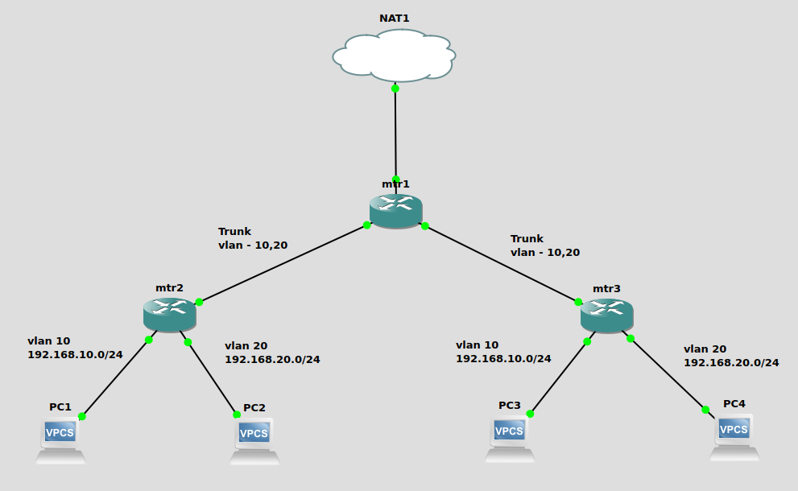

# Mikrotik VLAN Trunking

VLAN (Virtual Local Area Network) is not something new and unique to Mikrotik networking devices. It is an amazing technology we have to segregate the different LANs on Layer 2 switching. Different vendors implement the VLAN and VLAN trunking technology differently but all follows the same 802.1q standard for tagging and untagging VLANs on their devices.&#x20;

In this article, I would like to demostrate the VLAN capability on Mikrotik and how we can configure it easily in RouterOS. Note that most of the Mikrotik networking devices come with dedicated switch chip on RouterBoard to perform hardware offloading for more efficient switching at Layer 2 rather than passing the loads to main CPU. Since the Mikrotik device comes with RouterOS can configured as router with sub-interface for VLAN tagging which you would see it commonly in router-on-a-stick scenario, and switch with proper VLAN tagging and untagging to utilise the dedicated switch chip on RouterBoard.&#x20;

## Prerequisites&#x20;

* GNS3 Emulator
* Mikrotik CHR appliance setup on GNS3&#x20;
* Mikrotik RouterOS version 7.7
* Basic level of comfortableness with Mikrotik RouterOS CLI and GNS3 setup

## &#x20;Network Topology

<figure><figcaption>
Mikrotik VLANs
</figcaption></figure>

* Two swtiches - mtr2 and mtr3; each has two VLANs namely ops1 and ops2
* One router - mtr1 which is bridging between two switches with routing capability for internet breakout to NAT1 cloud and inter-VLAN routing

## Configuration

### MTR1 router config

This mtr1 acts as router therefore it uses the software VLAN sub-interfaces on the physical port of the device. Here is the full configuration of mtr1 router on the top of its topology.&#x20;

<pre><code># Create two bridges to bridge each VLAN (10 and 20) between mtr2 and mtr3 
/interface bridge
add name=lan-br-vlan10
add name=lan-br-vlan20

<strong># Name ether1 as "wan" for easy reference
</strong><strong>/interface ethernet
</strong>set [ find default-name=ether1 ] disable-running-check=no name=wan

# Create software VLAN sub-interfaces on ether2 and ether3 physical ports
/interface vlan
add interface=ether2 name=e2-vl10 vlan-id=10
add interface=ether2 name=e2-vl20 vlan-id=20
add interface=ether3 name=e3-vl10 vlan-id=10
add interface=ether3 name=e3-vl20 vlan-id=20

# Create two ip pools for ops1 network (VLAN10) and ops2 network (VLAN20)
/ip pool
add name=ops1 ranges=192.168.10.2-192.168.10.254
add name=ops2 ranges=192.168.20.2-192.168.20.254

# Setup dhcp-server with the new ip pools on the bridge interfaces
/ip dhcp-server
add address-pool=ops1 interface=lan-br-vlan10 name=dhcp1
add address-pool=ops2 interface=lan-br-vlan20 name=dhcp2

# Assign relevant sub-interface VLAN to appropriate bridge interface
/interface bridge port
add bridge=lan-br-vlan10 interface=e2-vl10
add bridge=lan-br-vlan20 interface=e2-vl20
add bridge=lan-br-vlan10 interface=e3-vl10
add bridge=lan-br-vlan20 interface=e3-vl20

# Assign ip address on the bridge interfaces
/ip address
add address=192.168.10.1/24 interface=lan-br-vlan10 network=192.168.10.0
add address=192.168.20.1/24 interface=lan-br-vlan20 network=192.168.20.0

# Disable dhcp-client on wan port
/ip dhcp-client
add interface=wan

# Configure dhcp network parameters for dhcp servers
/ip dhcp-server network
add address=192.168.10.0/24 dns-server=1.1.1.1 gateway=192.168.10.1
add address=192.168.20.0/24 dns-server=8.8.8.8 gateway=192.168.20.1

# Configure masquerade NAT rule for internet breakout to NAT1 cloud
/ip firewall nat
add action=masquerade chain=srcnat out-interface=wan

# Set the device name as mtr1
/system identity
set name=mtr1
</code></pre>

