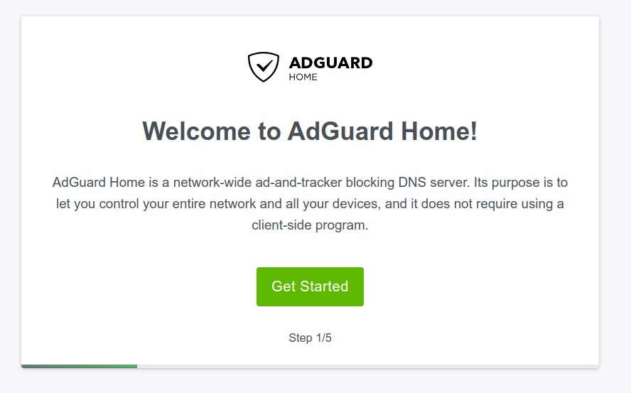
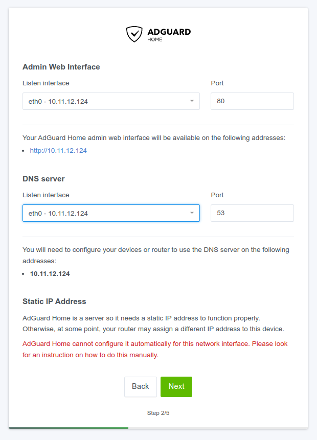
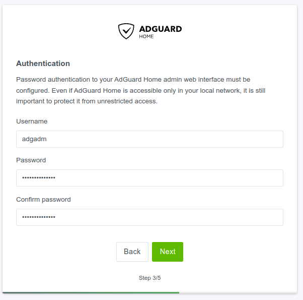
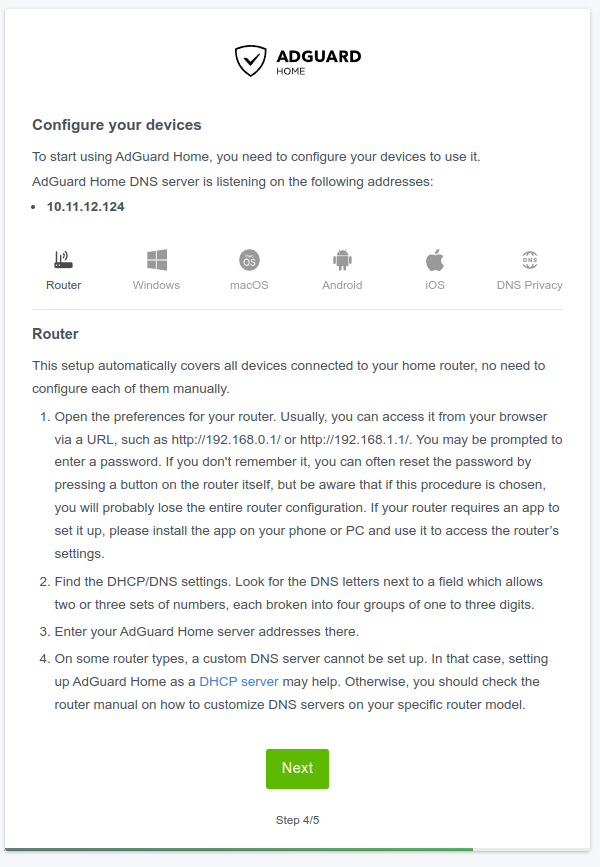
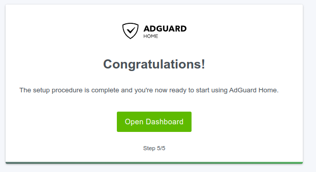
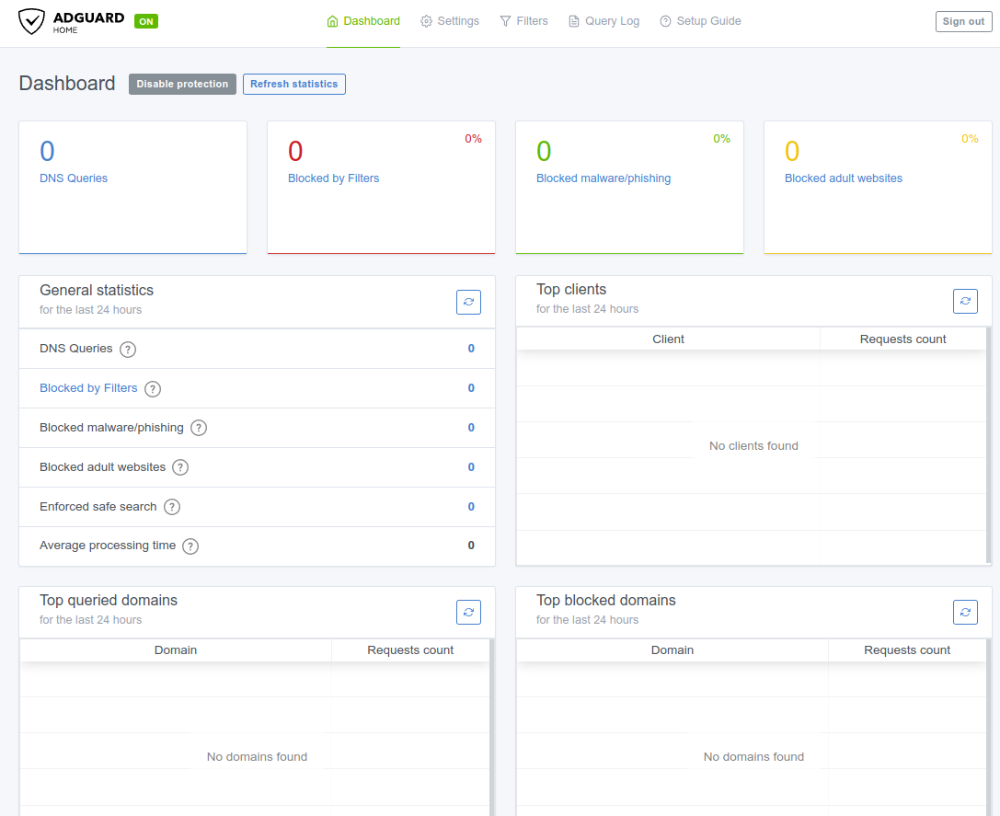

# Setting up AdGuard Home

AdGuard Home is alternative to Pi-Hole for network-wide Ad blocking but it has more capabilities for parental control and some other additional features. I have been using Pi-Hole on my home server, Raspberry Pi, virtual machine and even Docker container at home network to stop all annoying ads pop-ups on my mobile devices and computers for some time. However, recently AdGuard Home has got my attention since I found out that OpenWRT can run AdGuard Home natively without requring any additional server. It has been a year now using AdGuard Home instead of Pi-Hole on my home network.

## Prerequisites

* Dedicated bare-metal Linux server (Raspberry Pi 3, 4 or even Pi Zero 2 w) or Linux virtual machine running on some kind of type 1 hypervisor
* Docker if you like to use the docker container for AdGuard Home (I use a dedicated VM to deploy AdGuard Home)
* Basic understanding of Linux commands and YAML for backend configuration change

## Installation

For automated install on LInux, run the following command.

```
curl -s -S -L https://raw.githubusercontent.com/AdguardTeam/AdGuardHome/master/scripts/install.sh | sh -s -- -v
```

For other methods of installation, go to AdGuardHome Github page [https://github.com/AdguardTeam/AdGuardHome#getting-started](https://github.com/AdguardTeam/AdGuardHome#getting-started)

Following is the output of its installation.&#x20;

```
root@adguard:~# curl -s -S -L https://raw.githubusercontent.com/AdguardTeam/AdGuardHome/master/scripts/install.sh | sh -s -- -v
starting AdGuard Home installation script
channel: release
operating system: linux
cpu type: amd64
AdGuard Home will be installed into /opt/AdGuardHome
checking tar
script is executed with root privileges
no need to uninstall
downloading package from https://static.adtidy.org/adguardhome/release/AdGuardHome_linux_amd64.tar.gz -> AdGuardHome_linux_amd64.tar.gz
successfully downloaded AdGuardHome_linux_amd64.tar.gz
unpacking package from AdGuardHome_linux_amd64.tar.gz into /opt
successfully unpacked, contents: 
total 27372
-rwxrwxrwx 1 root root 27889664 Mar 10 00:03 AdGuardHome
-rw-rw-rw- 1 root root      587 Mar 10 00:03 AdGuardHome.sig
-rw-r--r-- 1 root root    70640 Mar 10 00:03 CHANGELOG.md
-rw-r--r-- 1 root root    35149 Mar 10 00:03 LICENSE.txt
-rw-r--r-- 1 root root    21563 Mar 10 00:03 README.md
2023/03/20 21:02:03 [info] AdGuard Home, version v0.107.26
2023/03/20 21:02:03 [info] service: control action: install
2023/03/20 21:02:03 [info] service: started
2023/03/20 21:02:03 [info] Almost ready!
AdGuard Home is successfully installed and will automatically start on boot.
There are a few more things that must be configured before you can use it.
Click on the link below and follow the Installation Wizard steps to finish setup.
AdGuard Home is now available at the following addresses:
2023/03/20 21:02:03 [info] go to http://127.0.0.1:3000
2023/03/20 21:02:03 [info] go to http://[::1]:3000
2023/03/20 21:02:03 [info] go to http://10.11.12.124:3000
2023/03/20 21:02:03 [info] go to http://[fe80::7ce0:42ff:fef1:1425%eth0]:3000
2023/03/20 21:02:03 [info] service: action install has been done successfully on linux-systemd
AdGuard Home is now installed and running
you can control the service status with the following commands:
sudo /opt/AdGuardHome/AdGuardHome -s start|stop|restart|status|install|uninstall
```

## Configuration

After the AdGuard Home installation, the welcome page will be displayed on the screen to initiate the setup in the server upon going to http://10.11.12.124:3000 in web browser.&#x20;

<figure><figcaption></figcaption></figure>

Click "Get Started" button to go next and it will take you to the page where you can configure "Admin Web Interface" and "DNS server" listen interfaces as below. Note that it is important to have the static IP address has been set in prior to the AdGuard Home installation or make an IP address reservation in DHCP server. After configure both admin web interface and dns server listen interface, click "Next".

<figure><figcaption></figcaption></figure>

On the next screen, you can setup the admin account for AdGuard Home web portal  as below. I use "adgadm" as my username and a strong password as my password as shown. Again, click "Next" to continue with its setup.&#x20;

<figure><figcaption></figcaption></figure>

Then it will show you can configure your devices to use with AdGuard Home. The default or preferable option is "Router" while it is assuming that your home internet gateway router configured as DHCP server. Click "Next" to go to the next page.&#x20;

<figure><figcaption></figcaption></figure>

Now it is ready to start using it as a networkwise adblocker or parental control. Click "Open Dashboard" for the login page.

<figure><figcaption></figcaption></figure>

Login with the defined username and password in the previous step.&#x20;

<figure><figcaption></figcaption></figure>

As you can see, the AdGuard Home dashboard is clean and neat.

<figure><figcaption></figcaption></figure>

Let's have a look at how we can configure the DHCP server to use with AdGuard Home in the network. Mikrotik hAP ac is used my home internet gateway router for DHCP server.

```
[mtradm@home-mtr] /ip/dhcp-server> export
/ip pool
add name=dhcp ranges=10.11.12.10-10.11.12.60
/ip dhcp-server
add address-pool=dhcp interface=lan name=dhcp1
/ip dhcp-server network
add address=10.11.12.0/24 dns-server=10.11.12.124 gateway=10.11.12.254 netmask=24
```

For all AdGuard Home related configuration including block lists, upstream dns servers and clients list, I have configured all in a YAML file called _AdGuardHome.yaml_ located in /opt/AdGuardHome/ directory. The same configuration can also be done in the AdGuard Home web GUI.

```yaml
bind_host: 10.11.12.124
bind_port: 80
users:
  - name: adgadm
    password: $2a$10$fJ3VeHn1WeZaqdiJ8rFRL.zkSc.WN/6OmDunZKlrbnI5WxOAzWlpO
auth_attempts: 5
block_auth_min: 15
http_proxy: ""
language: ""
theme: auto
debug_pprof: false
web_session_ttl: 720
dns:
  bind_hosts:
    - 10.11.12.124
  port: 53
  anonymize_client_ip: false
  protection_enabled: true
  blocking_mode: default
  blocking_ipv4: ""
  blocking_ipv6: ""
  blocked_response_ttl: 10
  parental_block_host: family-block.dns.adguard.com
  safebrowsing_block_host: standard-block.dns.adguard.com
  ratelimit: 20
  ratelimit_whitelist: []
  refuse_any: true
  upstream_dns:
    - https://family.cloudflare-dns.com/dns-query
    - https://family.adguard-dns.com/dns-query
    - https://adblock.doh.mullvad.net/dns-query
    - https://doh.familyshield.opendns.com/dns-query
  upstream_dns_file: ""
  bootstrap_dns:
    - 1.1.1.3
    - 1.0.0.3
    - 2606:4700:4700::1113
    - 2606:4700:4700::1003
    - 94.140.14.14
    - 94.140.15.15
    - 2a10:50c0::ad1:ff
    - 2a10:50c0::ad2:ff
    - 208.67.222.222
    - 208.67.220.220
    - 2620:119:35::35
    - 2620:119:53::53
  all_servers: false
  fastest_addr: false
  fastest_timeout: 1s
  allowed_clients: []
  disallowed_clients: []
  blocked_hosts:
    - version.bind
    - id.server
    - hostname.bind
  trusted_proxies:
    - 127.0.0.0/8
    - ::1/128
  cache_size: 0
  cache_ttl_min: 0
  cache_ttl_max: 0
  cache_optimistic: true
  bogus_nxdomain: []
  aaaa_disabled: false
  enable_dnssec: false
  edns_client_subnet:
    custom_ip: ""
    enabled: false
    use_custom: false
  max_goroutines: 300
  handle_ddr: true
  ipset: []
  ipset_file: ""
  filtering_enabled: true
  filters_update_interval: 24
  parental_enabled: true
  safesearch_enabled: true
  safebrowsing_enabled: true
  safebrowsing_cache_size: 1048576
  safesearch_cache_size: 1048576
  parental_cache_size: 1048576
  cache_time: 30
  rewrites:
    - domain: mtr.home
      answer: 10.11.12.254
    - domain: printer.home
      answer: 10.11.12.123
    - domain: desktop1.home
      answer: 10.11.12.121
  blocked_services: []
  upstream_timeout: 10s
  private_networks: []
  use_private_ptr_resolvers: true
  local_ptr_upstreams:
    - 10.11.12.254
  use_dns64: false
  dns64_prefixes: []
  serve_http3: false
  use_http3_upstreams: false
tls:
  enabled: false
  server_name: ""
  force_https: false
  port_https: 443
  port_dns_over_tls: 853
  port_dns_over_quic: 853
  port_dnscrypt: 0
  dnscrypt_config_file: ""
  allow_unencrypted_doh: false
  certificate_chain: ""
  private_key: ""
  certificate_path: ""
  private_key_path: ""
  strict_sni_check: false
querylog:
  enabled: true
  file_enabled: true
  interval: 720h
  size_memory: 1000
  ignored: []
statistics:
  enabled: true
  interval: 30
  ignored: []
filters:
  - enabled: true
    url: https://adguardteam.github.io/AdGuardSDNSFilter/Filters/filter.txt
    name: AdGuard DNS filter
    id: 1
  - enabled: true
    url: https://adaway.org/hosts.txt
    name: AdAway Default Blocklist
    id: 2
  - enabled: true
    url: https://someonewhocares.org/hosts/zero/hosts
    name: Dan Pollock's List
    id: 1666514532
  - enabled: true
    url: https://raw.githubusercontent.com/Perflyst/PiHoleBlocklist/master/SmartTV-AGH.txt
    name: Perflyst and Dandelion Sprout's Smart-TV Blocklist
    id: 1666514533
  - enabled: true
    url: https://abp.oisd.nl/basic/
    name: OISD Blocklist Basic
    id: 1666514534
  - enabled: true
    url: https://raw.githubusercontent.com/DandelionSprout/adfilt/master/GameConsoleAdblockList.txt
    name: Game Console Adblock List
    id: 1666514535
  - enabled: true
    url: https://pgl.yoyo.org/adservers/serverlist.php?hostformat=adblockplus&showintro=1&mimetype=plaintext
    name: Peter Lowe's List
    id: 1666514536
  - enabled: true
    url: https://raw.githubusercontent.com/DandelionSprout/adfilt/master/Alternate%20versions%20Anti-Malware%20List/AntiMalwareAdGuardHome.txt
    name: Dandelion Sprout's Anti-Malware List
    id: 1666514537
  - enabled: true
    url: https://raw.githubusercontent.com/hoshsadiq/adblock-nocoin-list/master/hosts.txt
    name: NoCoin Filter List
    id: 1666514538
  - enabled: true
    url: https://raw.githubusercontent.com/durablenapkin/scamblocklist/master/adguard.txt
    name: Scam Blocklist by DurableNapkin
    id: 1666514539
  - enabled: true
    url: https://raw.githubusercontent.com/mitchellkrogza/The-Big-List-of-Hacked-Malware-Web-Sites/master/hosts
    name: The Big List of Hacked Malware Web Sites
    id: 1666514540
  - enabled: true
    url: https://malware-filter.gitlab.io/malware-filter/urlhaus-filter-agh-online.txt
    name: Online Malicious URL Blocklist
    id: 1666514541
  - enabled: true
    url: https://raw.githubusercontent.com/crazy-max/WindowsSpyBlocker/master/data/hosts/spy.txt
    name: WindowsSpyBlocker - Hosts spy rules
    id: 1666514542
  - enabled: true
    url: https://raw.githubusercontent.com/PolishFiltersTeam/KADhosts/master/KADhosts.txt
    name: Firebog Suspicious List 1
    id: 1666514543
  - enabled: true
    url: https://raw.githubusercontent.com/FadeMind/hosts.extras/master/add.Spam/hosts
    name: Firebog Suspicious List 2
    id: 1666514544
  - enabled: true
    url: https://v.firebog.net/hosts/static/w3kbl.txt
    name: Firebog Suspicious List 3
    id: 1666514545
  - enabled: true
    url: https://v.firebog.net/hosts/AdguardDNS.txt
    name: Firebog Advertising List 1
    id: 1666514546
  - enabled: true
    url: https://v.firebog.net/hosts/Admiral.txt
    name: Firebog Advertising List 2
    id: 1666514547
  - enabled: true
    url: https://raw.githubusercontent.com/anudeepND/blacklist/master/adservers.txt
    name: Firebog Advertising List 3
    id: 1666514548
  - enabled: true
    url: https://s3.amazonaws.com/lists.disconnect.me/simple_ad.txt
    name: Firebog Advertising List 4
    id: 1666514549
  - enabled: true
    url: https://v.firebog.net/hosts/Easylist.txt
    name: Firebog Advertising List 5
    id: 1666514550
  - enabled: true
    url: https://pgl.yoyo.org/adservers/serverlist.php?hostformat=hosts&showintro=0&mimetype=plaintext
    name: Firebog Advertising List 6
    id: 1666514551
  - enabled: true
    url: https://raw.githubusercontent.com/FadeMind/hosts.extras/master/UncheckyAds/hosts
    name: Firebog Advertising List 7
    id: 1666514552
  - enabled: true
    url: https://raw.githubusercontent.com/bigdargon/hostsVN/master/hosts
    name: Firebog Advertising List 8
    id: 1666514553
  - enabled: true
    url: https://v.firebog.net/hosts/Easyprivacy.txt
    name: Firebog Tracking & Telemetry List 1
    id: 1666514555
  - enabled: true
    url: https://v.firebog.net/hosts/Prigent-Ads.txt
    name: Firebog Tracking & Telemetry List 2
    id: 1666514556
  - enabled: true
    url: https://raw.githubusercontent.com/FadeMind/hosts.extras/master/add.2o7Net/hosts
    name: Firebog Tracking & Telemetry List 3
    id: 1666514557
  - enabled: true
    url: https://hostfiles.frogeye.fr/firstparty-trackers-hosts.txt
    name: Firebog Tracking & Telemetry List 4
    id: 1666514558
  - enabled: true
    url: https://raw.githubusercontent.com/DandelionSprout/adfilt/master/Alternate%20versions%20Anti-Malware%20List/AntiMalwareHosts.txt
    name: Firebog Malicious List 1
    id: 1666514559
  - enabled: true
    url: https://osint.digitalside.it/Threat-Intel/lists/latestdomains.txt
    name: Firebog Malicious List 2
    id: 1666514560
  - enabled: true
    url: https://s3.amazonaws.com/lists.disconnect.me/simple_malvertising.txt
    name: Firebog Malicious List 3
    id: 1666514561
  - enabled: true
    url: https://v.firebog.net/hosts/Prigent-Crypto.txt
    name: Firebog Malicious List 4
    id: 1666514562
  - enabled: true
    url: https://raw.githubusercontent.com/FadeMind/hosts.extras/master/add.Risk/hosts
    name: Firebog Malicious List 5
    id: 1666514563
  - enabled: true
    url: https://bitbucket.org/ethanr/dns-blacklists/raw/8575c9f96e5b4a1308f2f12394abd86d0927a4a0/bad_lists/Mandiant_APT1_Report_Appendix_D.txt
    name: Firebog Malicious List 6
    id: 1666514564
  - enabled: true
    url: https://phishing.army/download/phishing_army_blocklist_extended.txt
    name: Firebog Malicious List 7
    id: 1666514565
  - enabled: true
    url: https://malware-filter.gitlab.io/malware-filter/phishing-filter-hosts.txt
    name: Firebog Malicious List 8
    id: 1666514566
  - enabled: true
    url: https://gitlab.com/quidsup/notrack-blocklists/raw/master/notrack-malware.txt
    name: Firebog Malicious List 9
    id: 1666514567
  - enabled: true
    url: https://v.firebog.net/hosts/RPiList-Malware.txt
    name: Firebog Malicious List 10
    id: 1666514568
  - enabled: true
    url: https://v.firebog.net/hosts/RPiList-Phishing.txt
    name: Firebog Malicious List 11
    id: 1666514569
  - enabled: true
    url: https://raw.githubusercontent.com/Spam404/lists/master/main-blacklist.txt
    name: Firebog Malicious List 12
    id: 1666514570
  - enabled: true
    url: https://raw.githubusercontent.com/AssoEchap/stalkerware-indicators/master/generated/hosts
    name: Firebog Malicious List 13
    id: 1666514571
  - enabled: true
    url: https://urlhaus.abuse.ch/downloads/hostfile/
    name: Firebog Malicious List 14
    id: 1666514572
  - enabled: true
    url: https://zerodot1.gitlab.io/CoinBlockerLists/hosts_browser
    name: Firebog Other List 1
    id: 1666514573
whitelist_filters: []
user_rules: []
dhcp:
  enabled: false
  interface_name: ""
  local_domain_name: lan
  dhcpv4:
    gateway_ip: ""
    subnet_mask: ""
    range_start: ""
    range_end: ""
    lease_duration: 86400
    icmp_timeout_msec: 1000
    options: []
  dhcpv6:
    range_start: ""
    lease_duration: 86400
    ra_slaac_only: false
    ra_allow_slaac: false
clients:
  runtime_sources:
    whois: true
    arp: true
    rdns: true
    dhcp: true
    hosts: true
  persistent:
    - name: laptop1
      tags:
        - device_laptop
        - os_windows
        - user_regular
      ids:
        - 10.11.12.43
      blocked_services: []
      upstreams: []
      use_global_settings: true
      filtering_enabled: false
      parental_enabled: false
      safesearch_enabled: false
      safebrowsing_enabled: false
      use_global_blocked_services: true
    - name: printer
      tags:
        - device_printer
        - os_other
        - user_regular
      ids:
        - 10.11.12.123
      blocked_services: []
      upstreams: []
      use_global_settings: true
      filtering_enabled: false
      parental_enabled: false
      safesearch_enabled: false
      safebrowsing_enabled: false
      use_global_blocked_services: true
    - name: desktop1
      tags:
        - device_pc
        - os_linux
        - user_admin
      ids:
        - 10.11.12.121
      blocked_services: []
      upstreams:
        - tls://unfiltered.adguard-dns.com
        - https://unfiltered.adguard-dns.com/dns-query
        - quic://unfiltered.adguard-dns.com
        - 1.1.1.2
        - 1.0.0.2
      use_global_settings: false
      filtering_enabled: true
      parental_enabled: false
      safesearch_enabled: false
      safebrowsing_enabled: true
      use_global_blocked_services: true
    - name: iphone1
      tags:
        - device_phone
        - os_ios
        - user_regular
      ids:
        - 10.11.12.122
      blocked_services: []
      upstreams: []
      use_global_settings: true
      filtering_enabled: false
      parental_enabled: false
      safesearch_enabled: false
      safebrowsing_enabled: false
      use_global_blocked_services: true
    - name: kid-ipad1
      tags:
        - device_tablet
        - os_ios
        - user_child
      ids:
        - 10.11.12.49
      blocked_services: []
      upstreams: []
      use_global_settings: true
      filtering_enabled: false
      parental_enabled: false
      safesearch_enabled: false
      safebrowsing_enabled: false
      use_global_blocked_services: true
    - name: kid-ipod1
      tags:
        - device_phone
        - os_ios
        - user_child
      ids:
        - 10.11.12.50
      blocked_services: []
      upstreams: []
      use_global_settings: true
      filtering_enabled: false
      parental_enabled: false
      safesearch_enabled: false
      safebrowsing_enabled: false
      use_global_blocked_services: true
    - name: android1
      tags:
        - device_phone
        - os_android
        - user_admin
      ids:
        - 10.11.12.51
      blocked_services: []
      upstreams:
        - tls://unfiltered.adguard-dns.com
        - https://unfiltered.adguard-dns.com/dns-query
        - quic://unfiltered.adguard-dns.com
        - 1.1.1.2
        - 1.0.0.2
      use_global_settings: false
      filtering_enabled: true
      parental_enabled: false
      safesearch_enabled: false
      safebrowsing_enabled: true
      use_global_blocked_services: true
    - name: android2
      tags:
        - device_phone
        - os_android
        - user_admin
      ids:
        - 10.11.12.52
      blocked_services: []
      upstreams:
        - tls://unfiltered.adguard-dns.com
        - https://unfiltered.adguard-dns.com/dns-query
        - quic://unfiltered.adguard-dns.com
        - 1.1.1.2
        - 1.0.0.2
      use_global_settings: false
      filtering_enabled: true
      parental_enabled: false
      safesearch_enabled: false
      safebrowsing_enabled: true
      use_global_blocked_services: true
    - name: tv1
      tags:
        - device_tv
        - os_android
        - user_regular
      ids:
        - 10.11.12.53
      blocked_services: []
      upstreams: []
      use_global_settings: true
      filtering_enabled: false
      parental_enabled: false
      safesearch_enabled: false
      safebrowsing_enabled: false
      use_global_blocked_services: true
log_file: ""
log_max_backups: 0
log_max_size: 100
log_max_age: 3
log_compress: false
log_localtime: false
verbose: false
os:
  group: ""
  user: ""
  rlimit_nofile: 0
schema_version: 17
```
